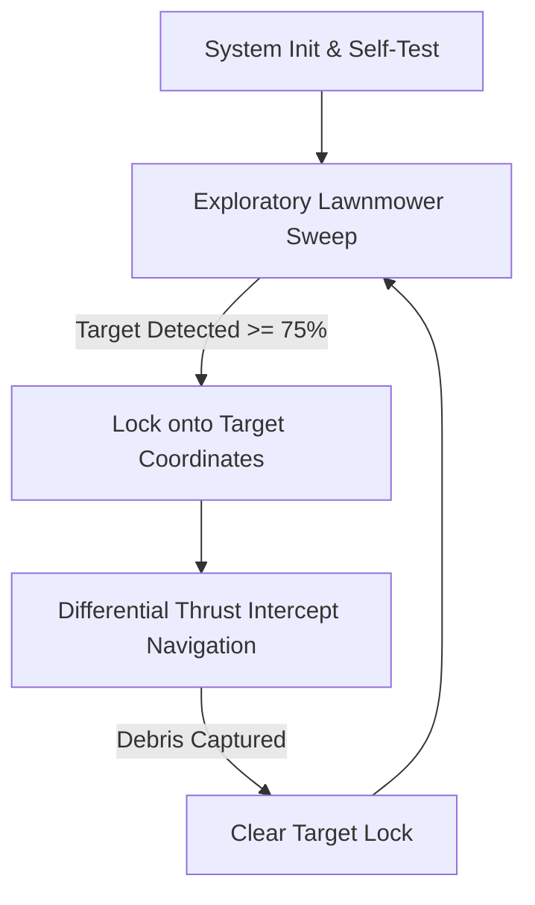

# EcoFloat-2 (v1.0.0)
> **Autonomous AI-Driven Catamaran for Solid Waste Collection and Aquatic Monitoring**

[](LICENSE)
[](https://github.com/Nandhu2036/EcoFloat-2/issues)
[](https://github.com/Nandhu2036/EcoFloat-2/releases)
[](#)

---

## 1. Overview & Objectives
**EcoFloat-2** is an autonomous, AI-driven twin-hull catamaran robot built to collect surface macroplastics (PET bottles, styrofoam cups, packaging wraps) and monitor water quality in stagnant urban reservoirs. 

Unlike traditional conveyor-belt skimmers that consume excessive power and seize due to weeds wrapping around gears, EcoFloat-2 features a **passive induction flow channel** that guides floating plastics directly into a trailing mesh net as the vessel glides forward.

---

## 2. Technical Blueprint & Hardware Stack
The vessel executes real-time AI inferences entirely at the edge on a local single-board microprocessor, maintaining high operational autonomy without cellular or cloud links.

- **Primary compute**: Raspberry Pi 4 Model B
- **Propulsion**: Dual $12\text{V}$ high-torque underwater DC marine thrusters (transom-mounted)
- **Motor Control**: BTS7960 high-amp H-bridge driver or ESCs
- **Primary Power**: $12\text{V}$ 10Ah LiFePO4 battery pack
- **Regulator**: $5\text{V}/3\text{A}$ step-down buck converter (UBEC)
- **Optical Input**: Fixed-focus wide-angle $120^\circ$ USB Camera

---

## 3. Engineering Physics & Buoyancy Calculations
To ensure physical stability during high-load periods, the hull is designed with rigorous metacentric and displacement constraints:

- **Max Twin Hull Displacement**:
  \[V = 2 \times (L \times W \times D) = 2 \times (0.7\text{ m} \times 0.1\text{ m} \times 0.12\text{ m}) = 16.8\text{ Liters}\]
- **Buoyancy Equilibrium**:
  \[F_b = \rho_{water} \times V_{disp} \times g\]
- **Design Draft**: Supporting $6.0\text{ kg}$ dry vessel mass + $4.0\text{ kg}$ debris payload. Total mass = $10.0\text{ kg}$. The designed hull draft height fraction is:
  \[Draft = \frac{10.0\text{ kg}}{16.8\text{ kg}} = 59.5\%\]

---

## 4. Software Architecture & Control Loops



### Proportional Steering Error Feedback
Visual frames are processed on-device ($640 \times 480$ resolution). If a plastic object is detected, the horizontal pixel offset from center is calculated:
\[\Delta e = X_c - 320\]
Motor speeds are adjusted dynamically to align the vessel:
- $\Delta e \approx 0$ (Target Centered): Command equal PWM to both thrusters (port & starboard).
- $\Delta e > 0$ (Target Right): Increase port motor thrust, decrease starboard motor thrust.
- $\Delta e < 0$ (Target Left): Increase starboard motor thrust, decrease port motor thrust.

---

## 5. Folder Structure
```
/
├── README.md
├── LICENSE
├── .gitignore
├── CONTRIBUTING.md
├── CHANGELOG.md
├── CODE_OF_CONDUCT.md
│
├── docs/
│   ├── overview.md
│   ├── design-buoyancy-hydrodynamics.md
│   ├── electronics-power-subsystem.md
│   └── software-tracking-pathing.md
│
├── models/
│   └── cad/                    # STEP, STL, and F3D files
│
├── assets/
│   └── renders/                # Render screenshots
│
├── reports/
│   ├── complete-project-report.pdf
│   ├── eco-float-pitchdeck.pdf
│   └── declaration-form-ecofloat.pdf
│
└── src/
    ├── main.py                 # Central State Machine
    ├── camera.py               # Frame Grabber Interface
    ├── detector.py             # TensorFlow Lite Object Detection
    ├── navigation.py           # P-Feedback Steering Controller
    ├── propulsion.py           # BTS7960 / PWM Motor Commander
    ├── telemetry.py            # Local Logging System
    │
    ├── arduino/
    │   └── thruster_interface/
    │       └── thruster_interface.ino  # Low-level MCU controller
    │
    └── simulation/
        └── sim_run.py          # Interactive local simulator
```

---

## 6. Slicing & 3D Printing Parameters
All structural components are modeled for additive manufacturing using durable, UV-resistant Glycol-modified Polyester (PETG):

| Component Name | Material | Infill Density | Infill Pattern | Wall Perimeters |
|---|---|---|---|---|
| **Catamaran Hulls** | PETG (Yellow) | $20\%$ | Gyroid | 4 |
| **Crank & Brackets** | PETG (Black) | $40\%$ | Grid | 6 |
| **Main Transom Mounts** | PETG (Black) | $60\%$ | Cubic | 6 |
| **Electronics Enclosure** | PETG (Yellow) | $30\%$ | Gyroid | 4 |

---

## 7. Running the Simulator
To run the local verification simulator showing the navigation feedback loop and object detection target locks:
1. Initialize environment:
   ```bash
   pip install pygame opencv-python
   ```
2. Launch simulator:
   ```bash
   python src/simulation/sim_run.py
   ```
*Use the mouse cursor in the simulation window to spawn plastic target trash on the water surface and watch the catamaran track and capture it.*

---

## 8. Acknowledgements
Developed as part of the **Naan Mudhalvan Niral Thiruvizha 3.0** (2025-2026) Hackathon initiative at **St. Joseph's College of Engineering**, Department of Mechanical Engineering.

---

## 9. Contact & Author
- **Author**: Nandhakumar G (GitHub: [@Nandhu2036](https://github.com/Nandhu2036))
- **Email**: nandhu2036os@gmail.com
